# AutoML Lab

**Open-source AutoML for tabular prediction and time-series forecasting,
benchmarked honestly against the strongest alternatives.**

[](https://github.com/NoLogLeftBehind-AI/automl-lab/actions/workflows/tabular-ci.yml)
[](https://github.com/NoLogLeftBehind-AI/automl-lab/actions/workflows/forecasting-ci.yml)
[](https://github.com/NoLogLeftBehind-AI/automl-lab/actions/workflows/serving-ci.yml)
[](LICENSE)
[](tabular/pyproject.toml)

Two engines — **tabular AutoML** (`automl`) and **multi-series forecasting**
(`autofc`) — built on scikit-learn, statsmodels, Prophet, and gradient
boosting. Drop in a dataset, name the target, Run All: you get a tuned,
blended, honestly-evaluated model and a one-folder deployable artifact
(model + scoring script + drift checker + self-contained HTML report + a log
of every automated decision).

## Headline results

All comparisons run on **identical train/holdout partitions with matched
optimization metrics** — challengers scored by shared harness code from raw
predictions, the engines' rows by the same metric functions on the same
partitions. See the benchmark READMEs for methodology and caveats.

Bold marks the best score in each row, not this project's.

| Task · dataset (metric ↓) | This project | 95% CI | Strongest challenger | Default baseline |
|---|---|---|---|---|
| Classification · Adult 48.8k (LogLoss) | 0.266 · 22 min | [0.256, 0.276] | AutoGluon best-quality **0.264** · 22 min | XGBoost 0.272 |
| Regression · Diamonds 53.9k (RMSE) | 538 · 27 min | [515, 560] | AutoGluon best-quality **516** · 22 min | XGBoost 554 |
| Forecasting · ERCOT 8-region (MASE) | **0.940** · 1.5 min | n/a — backtest¹ | AutoGluon-TS best-quality 1.046 · 21 min | statsforecast AutoARIMA 1.268 |

**In one sentence:** AutoGluon is slightly more accurate on the two tabular
datasets, this engine wins the forecasting panel, and it deploys as a 4.9 MB
pure-scikit-learn artifact whose whole inference environment is 21× lighter
than the one the benchmark ran in.

**Read the interval before the ranking.** On both tabular rows every gap — to
AutoGluon and to XGBoost alike — is smaller than the engine's own 95% bootstrap
CI on that holdout. These are single-run point estimates (one seed per system,
no paired significance test), so the *ordering* is what's claimed, not the
margin. The [benchmark README](benchmarks/tabular/README.md#reading-the-numbers-honestly)
names the test that would resolve it and states plainly that it isn't computed
here.

<sub>¹ The forecasting row is scored by 3-fold rolling-origin backtest rather
than a single locked holdout, so a holdout bootstrap CI does not apply; the
fold-to-fold spread is not committed to `results.json`.</sub>

Tabular: 0.8–4.3% behind AutoGluon at comparable time budgets (matched on
Adult; the engine ran ~24% longer on Diamonds — disclosed in the benchmark
README), ahead of default XGBoost on the headline metric on both datasets,
shipping a 4.9 MB pure-sklearn artifact that scores 1,000 rows in 58 ms and
imports nothing from this repository at inference. Both sides of that trade
are measured, including where it loses:
[`benchmarks/deployment/`](benchmarks/deployment/).

An [ablation](benchmarks/tabular/README.md#ablation-the-pruner-picks-the-wrong-twin-on-diamonds)
found that 82% of the Diamonds gap is not AutoGluon at all — it is this
engine's own correlation pruner discarding `carat`. With `carat` kept the gap
is 0.78%. The headline table above still reports the default pipeline's worse
number, because that is what the default pipeline does.

Forecasting: best accuracy on the demo panel at a fraction of AutoGluon-TS's
wall-clock (statsforecast's AutoETS and AutoTheta are faster still) — with the
caveats stated in
[the forecasting benchmark README](benchmarks/forecasting/README.md).

<p align="center">
  
</p>

## What's here

| Folder | Contents |
|---|---|
| [`tabular/`](tabular/) | The tabular engine: guardrails with a decision audit, two-detector leakage scan, blueprint preprocessing (target encoding, native categoricals, dates, text), early-stopped GBMs, Optuna with a default-config guarantee, stacking/voting blenders, de-biased fresh-fold leaderboards, parsimony deployment picks, calibration repair, in-artifact decision thresholds. Two executed demo notebooks + 41 tests |
| [`forecasting/`](forecasting/) | The forecasting engine: panel guardrails, seasonal-strength detection, SARIMAX/ETS/Theta/Prophet + global GBM lag models, holiday calendars, rolling-origin MASE leaderboards, measured interval coverage for native-interval models (residual bands report `NaN` rather than a made-up number), **hierarchical reconciliation (MinT)**. Executed ERCOT demo + 43 tests |
| [`benchmarks/tabular/`](benchmarks/tabular/) | vs **AutoGluon** on identical partitions, matched metrics & time budgets |
| [`benchmarks/forecasting/`](benchmarks/forecasting/) | vs **Nixtla statsforecast** and **AutoGluon-TS** on identical folds |
| [`benchmarks/deployment/`](benchmarks/deployment/) | What the accuracy gap buys: artifact size, `/predict` latency, and inference dependency closure vs AutoGluon — including the row where the artifact loses |
| [`serving/`](serving/) | FastAPI scoring service for any exported tabular artifact: `/predict`, `/drift`, `/health`, Dockerized |
| [`docs/`](docs/) | [Design decisions](docs/DESIGN.md) with the measured failure modes behind them, [what's deliberately out of scope and why](docs/SCOPE.md), and [dataset provenance](docs/DATA.md) |

## Reviewing this in ten minutes?

A suggested path through the strongest material:

1. **`tabular/automl/leakage.py`** (2 min) — the module docstring explains why
   there are *two* leakage detectors, including the measured failure mode
   (a tree-based scan with an R² threshold waves through a literal copy of a
   continuous target) that motivated the second one.
2. **[Design decisions](docs/DESIGN.md)** (3 min) — skim the headers; each is
   a judgment call with the failure mode it prevents. "The final leaderboard is
   re-scored on fresh folds" shapes the results most; "The leaderboard is a
   measurement; the deployment pick is a judgment" is the one that records a
   rule of mine being *wrong* — banding on a spread √k too wide — and what
   changed on all three demos once the arithmetic was checked.
3. **[The `carat` ablation](benchmarks/tabular/README.md#ablation-the-pruner-picks-the-wrong-twin-on-diamonds)**
   (2 min) — the shortest demonstration of what this repo is for. Measuring a
   confound I had disclosed showed that 82% of the Diamonds gap was my own
   correlation pruner, not AutoGluon. The headline table still reports the
   worse default number. Read "Reading the numbers honestly" in the same file
   for what the remaining gap buys.
4. **[The classification notebook](tabular/notebooks/automl_classification.ipynb)**
   (2 min) — committed with executed outputs: the full pipeline narrating its
   own decisions on 48k rows of real data.
5. **`serving/app.py`** (1 min) — a ~200-line service that scores any exported
   artifact with no engine dependency, because the artifact is
   self-describing.

The generated model reports (leaderboards, metrics with confidence intervals,
figures, full decision audit in one self-contained HTML file) are committed in
`tabular/examples/` and `forecasting/examples/` — download one and open it in
a browser.

If your question is "what *isn't* here?", that's answered directly in
[docs/SCOPE.md](docs/SCOPE.md) rather than left to be discovered.

## How the engines work

```mermaid
flowchart TB
  subgraph T [tabular engine — one call from raw dataframe to artifact]
    direction LR
    t1[profile +<br>guardrails] --> t2[locked holdout +<br>CV strategy] --> t3[leakage<br>scan] --> t4[screen 7 families<br>over 3 blueprints]
    t4 --> t5[Optuna tune,<br>defaults kept] --> t6[stack + vote<br>blenders] --> t7[re-score all on<br>fresh folds] --> t8[calibrate +<br>threshold] --> t9[holdout,<br>scored once] --> t10[(artifact)]
  end
  subgraph F [forecasting engine — one call from panel to backtested forecasts]
    direction LR
    f1[panel<br>guardrails] --> f2[seasonality<br>tested, not assumed] --> f3[roster: baselines, stats,<br>Prophet, global GBMs]
    f3 --> f4[rolling-origin<br>backtests] --> f5[MASE leaderboard<br>+ blend] --> f6[intervals with<br>measured coverage] --> f7[MinT<br>reconciliation] --> f8[(artifact)]
  end
```



## Quickstart

```bash
pip install -e "./tabular[full]" -e "./forecasting[full]"
```

(The `full` extras pull the GBM/Optuna/Prophet roster the results above use;
a bare `pip install -e ./tabular` also works — the engines degrade gracefully
and log every family they skip.)

```python
from automl import AutoML, AutoMLConfig            # tabular
AutoML(AutoMLConfig(target="income", task="classification")).run(df)

from autofc import AutoForecast, ForecastConfig    # forecasting
AutoForecast(ForecastConfig(horizon=28, series_col="store_id")).run(df)
```

Or open the narrated notebooks (each auto-fetches a public demo dataset and is
committed with executed outputs, so results are visible without running
anything): [classification](tabular/notebooks/automl_classification.ipynb) ·
[regression](tabular/notebooks/automl_regression.ipynb) ·
[forecasting](forecasting/notebooks/automl_forecasting.ipynb).

## The philosophy

Automation should never be a black box, and evaluation should never flatter
the model. Concretely: locked holdouts and rolling-origin backtests, final
leaderboards re-scored on fresh folds (no winner's curse), tuning that can't
ship worse than defaults, baselines that always compete, interval coverage
that is measured rather than assumed wherever a model has native intervals
(and reported as `NaN`, not invented, where it isn't — including for the
committed demo's own blended champion), reconciliation that is evaluated before
it's applied, a parsimony rule that recommends the simplest model within
noise of the winner (accuracy decides the leaderboard, not the deployment
alone), and a decision log in every artifact. The full list of judgment
calls — and the measured failure modes behind them — is in
[docs/DESIGN.md](docs/DESIGN.md).

The decisions about what *not* to build get their own document:
[**docs/SCOPE.md**](docs/SCOPE.md). This was built on personal time alongside
a full-time job, so the scope is triage against one criterion — signal about
modeling judgment per hour of work. Every omission there carries a reason,
because a scope boundary an interviewer has to discover for themselves is
a worse answer than one stated up front.

## Tests, CI, reproducibility

Three suites, **94 tests**: the tabular engine (41 — end-to-end smokes plus
guardrail regression tests), the forecasting engine (43), and the service
(10, which trains its own artifact so no pre-built one is needed). Run
everything:

```bash
pip install -e "./tabular[full]" -e "./forecasting[full]" \
            -r serving/requirements.txt pytest httpx ruff mypy
python -m pytest tabular/tests forecasting/tests serving/tests -q
ruff check .
mypy tabular/automl forecasting/autofc serving/app.py --ignore-missing-imports
```

(The service suite needs the *engine* too — it trains its own artifact rather
than shipping a fixture.)

The workflows in [`.github/workflows/`](.github/workflows/) run those same
gates on every push and pull request, plus both engine suites against pandas 2
*and* pandas 3 — the only CI failure this project has ever had was a
pandas-major behavioral difference, which is why the matrix exists.

Runs are seeded end-to-end, but gradient-boosting training is multithreaded
and therefore not bit-deterministic. How large that run-to-run drift is has
**not been measured** — no repeated-seed replication was run — and the
committed `results.json` predates the committed demo reports by eight engine
commits and a scikit-learn minor version, so the closeness of those two sets
of numbers is not a reproducibility measurement either ([provenance
note](benchmarks/tabular/README.md#reading-the-numbers-honestly)). The
benchmark tables are single-run point estimates rather than resolved
differences. Demo datasets are fetched at run time from stable public
mirrors; sources, licenses, and exact URLs are in
[docs/DATA.md](docs/DATA.md).

## License

[MIT](LICENSE).
