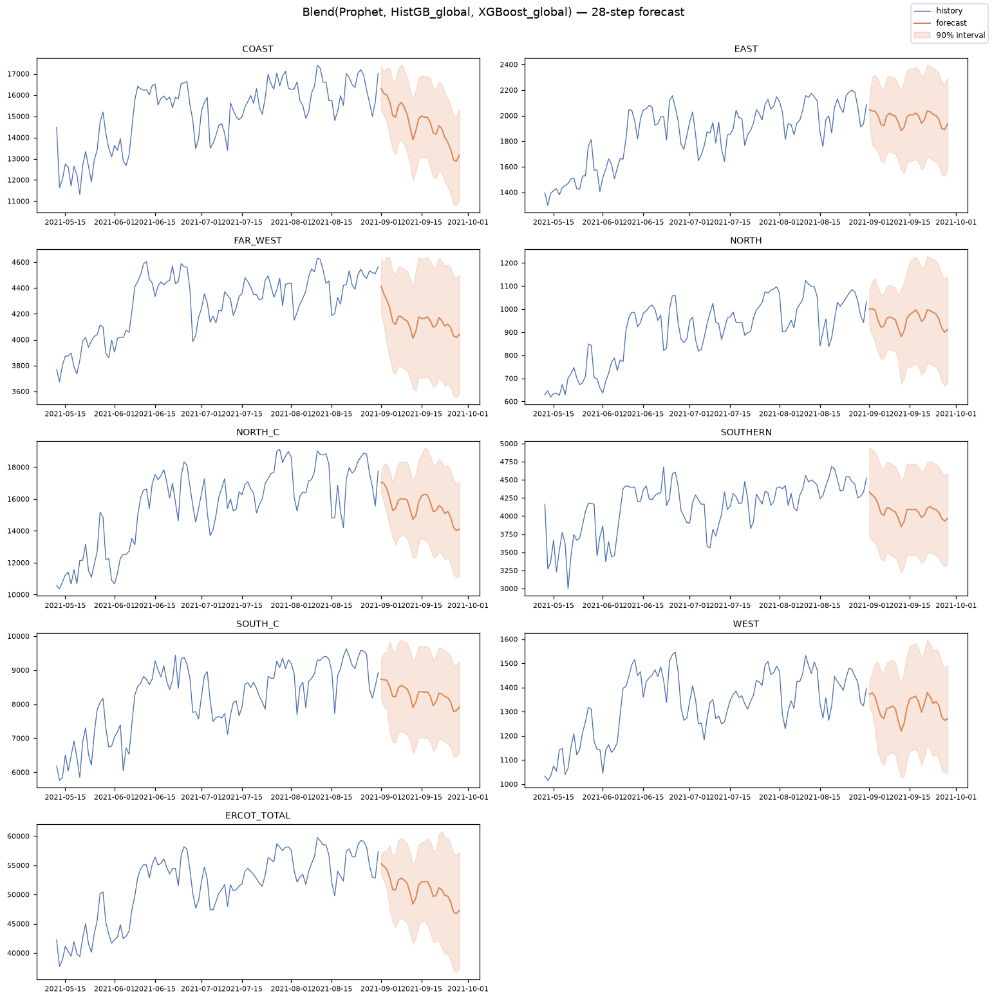

# AutoML Forecasting — automated time series on statsmodels + Prophet + GBMs

**Point it at a panel of time series, set the horizon, Run All — get
backtested forecasts with honest prediction intervals and a deployable
artifact back.**

Companion to the [tabular AutoML engine](../tabular/): the same
design language (guardrails, decision audit, leaderboard discipline, one-folder
artifact), applied to **single- and multi-series forecasting**.

## Quickstart

```bash
pip install -r requirements.txt
jupyter notebook notebooks/automl_forecasting.ipynb
```

or programmatically:

```python
from autofc import AutoForecast, ForecastConfig

fc = AutoForecast(ForecastConfig(horizon=28, series_col="store_id"))
fc.run(df)                 # long format: date, series ID, target, [exogenous...]
fc.leaderboard             # rolling-origin backtest leaderboard
fc.forecast_frame          # final forecast with prediction intervals
```

`ForecastConfig.fast(...)` gives a ~2-minute first pass.

## Results on the demo dataset

**Daily electricity load for the 8 ERCOT regions of Texas** (2016–2021), with
a **hierarchy** (regions sum to a synthesized `ERCOT_TOTAL` — 9 series) and
**US holiday calendars** enabled, forecasting 28 days ahead over 3
rolling-origin backtests. The [demo notebook](notebooks/automl_forecasting.ipynb)
is committed with its executed outputs and the generated report is in
[`examples/`](examples/report_forecasting.html). Total runtime: **5.4 min**
on 4 cores.

| Model | MASE ↓ | WAPE ↓ | 90%-interval coverage |
|---|---|---|---|
| **Blend(Prophet, HistGB, XGBoost)** | **0.961** | **6.6%** | residual-based |
| Prophet | 1.000 | 6.5% | 0.88 |
| HistGB (global) | 1.032 | 7.3% | residual-based |
| XGBoost (global) | 1.072 | 7.6% | residual-based |
| LightGBM (global) | 1.074 | 7.5% | residual-based |
| ETS | 1.230 | 9.0% | 0.99 |
| ... Drift, Naive, Theta, SeasonalNaive | 1.24–1.38 | 9–10% | 0.92–0.99 |
| AutoSARIMAX | 1.396 | 10.7% | 0.81 |

Then reconciliation, scored on the champion's own backtest folds:

| Reconciliation | MASE ↓ | WAPE ↓ |
|---|---|---|
| **Bottom-up — applied** | **0.940** | **6.5%** |
| MinT (shrunk covariance) | 0.950 | 6.5% |
| None (base forecasts) | 0.961 | 6.6% |
| Structural WLS | 1.165 | 8.0% |
| OLS | 1.384 | 9.5% |

<p align="center">
  
</p>

What the run demonstrates, honestly read:

- **Reconciliation is the textbook win, for a specific reason**: the base
  forecasts were incoherent by 1.68% of the total level; bottom-up made them
  coherent *and* 2.2% more accurate (0.961 → 0.940 MASE). Read that mechanism
  precisely, because it is not cross-series regularization: bottom-up's
  projection selects each leaf's own row, so **all eight regional forecasts
  are bit-identical before and after** — the entire MASE gain is the
  synthesized `ERCOT_TOTAL` parent being replaced by the sum of its children.
  What the number says is that the directly-forecast aggregate was worse than
  summing the parts, which is the common case and the reason bottom-up is a
  strong default. MinT is the method here that genuinely mixes information
  across series; with a leave-fold-out shrunk error covariance it lands a
  close second (0.950), and
  the OLS/WLS variants *hurt* here — so the engine's auto-selection earns its
  keep by scoring all five on the champion's own folds rather than assuming
  any one method helps. (Worth knowing which way the margin runs: bottom-up
  and MinT are separated by ~1% of MASE, well inside fold noise, so read this
  as "both coherent methods work, the fancy one is not required" rather than
  as a verdict against MinT — which in fact wins on RMSE, 859 vs 899.)
- **Seasonality detection earned its keep**: weekly strength 0.12, yearly 0.64
  — both confirmed, so ML models got seasonal lags + yearly calendar features
  and MASE is scaled against a real seasonal-naive.
- **The blend of Prophet + global GBMs wins the base leaderboard** — the
  expected result for 28-day-ahead daily data where a strong yearly cycle
  dominates a weak weekly one. AutoSARIMAX finishes last — behind even
  seasonal-naive, while burning 159 s, close to 4× the rest of the roster
  combined — and the leaderboard says so: fixed linear harmonics are the wrong
  tool at this horizon, which is exactly what an honest leaderboard is for. (One
  candid caveat: the blend's members are chosen on the same folds the blend
  is then scored on — a mild selection advantage; the
  [forecasting benchmark](../benchmarks/forecasting/) quantifies it by also
  reporting the members individually.) Winning the leaderboard is not the same
  as earning deployment, so the engine's **parsimony rule** asks separately
  whether the blend's margin justifies three models to refit and monitor —
  and here it does: the blend beats Prophet on *every* backtest fold, so the
  0.038 MASE lead is 3.4× the standard error of the paired fold differences
  (0.011) and the blend is the deployment pick as well as the leaderboard
  winner. Worth saying plainly because the earlier version of this rule banded
  on the marginal fold spread (0.159) instead, which swallowed the lead whole
  and handed the pick to Prophet — a conservative-looking rule that was
  discarding real evidence
  ([the design note](../docs/DESIGN.md#the-leaderboard-is-a-measurement-the-deployment-pick-is-a-judgment)).
- **Interval coverage is reported where intervals are native**: Prophet's
  0.88 sits just under the 90% target, AutoSARIMAX's 0.81 well under it, while
  ETS and the baselines are conservative (0.92–0.99) — miscalibration in
  either direction is visible at a glance.
  Residual-band models (the GBMs and the blend) get per-series empirical
  widths whose coverage is *not* backtested — the leaderboard says
  "residual-based" instead of pretending a number. On this demo those bands
  are built from 3 residuals per step, which caps their attainable coverage at
  **75%** however the 90% level is configured; the run logs that warning and
  the report badge carries it, because a band labelled 90% that structurally
  cannot reach it is the same species of dishonesty as an unmeasured number.

For how the engine compares against Nixtla statsforecast and AutoGluon-TS on
these same folds (base regions only, so every system sees identical inputs),
see [the forecasting benchmark](../benchmarks/forecasting/).

## What the engine does

| Stage | What happens |
|---|---|
| **Panel guardrails** | frequency inference per series (must agree across the panel), duplicate-timestamp aggregation, gap interpolation up to a threshold, short/gappy/constant series dropped loudly, wide→long helper, categorical exogenous coding — every action logged |
| **Seasonality detection** | calendar candidates per frequency (weekly/yearly for daily data, daily/weekly for hourly...), confirmed by **bias-corrected seasonal strength** — the raw phase-mean variance share is shrunk by the `m/n` baseline that `k` observed cycles explain spuriously under an **i.i.d. null**, which removes most but not all of the strength an integrated (random-walk-like) series shows at long candidate periods; seasonality is checked, not assumed |
| **Roster** | naive / seasonal-naive / drift baselines (always compete); auto-SARIMAX with a compact AIC order search (orders cached across backtest refits, long seasonalities via Fourier regressors, exogenous support); ETS; Theta; Prophet; and **global LightGBM/XGBoost/HistGB** models trained across all series on leak-safe lag/rolling/calendar features with recursive multi-step prediction — the M5-winning recipe for related series |
| **Rolling-origin backtests** | K cutoffs stepping back one horizon each; training data always strictly precedes the scored window; per-series scores averaged so a big series can't hide a bad one |
| **Leaderboard** | primary metric **MASE** (scale-free, < 1 beats one-step seasonal-naive) with sMAPE/WAPE/RMSE/MAE and **measured interval coverage** for native-interval models; a top-3 blend computed from stored fold predictions joins the field; a parsimony rule flags the fewest-models candidate within one standard error of the winner (the SE of the paired per-fold differences) as the **deployment pick** (`champion_policy` decides which ships); the engine **warns loudly when the champion barely improves on the best baseline** |
| **Prediction intervals** | native where models have them (SARIMAX/ETS/Theta/Prophet, and closed-form for the baselines); **per-series** backtest-residual quantile bands for ML models and blends — always labeled which. Residual bands carry a hard ceiling: built from `n` residuals per step they cannot exceed `n/(n+1)` coverage whatever level you configure, so the default 3 folds cap a "90%" band near **75%**. The engine computes that ceiling, warns when the configured level sits above it, and prints it on the report badge; the bands' own realised coverage is not backtested (they are fitted on those same residuals) |
| **Holiday calendars** | `country_holidays="US"` (any country the `holidays` package knows): day-of/before/after indicators feed the ML models and SARIMAX (as deterministic exog next to the Fourier terms); Prophet uses its built-ins |
| **Hierarchical reconciliation** | `hierarchy={"TOTAL": [...]}` (multi-level supported; absent parents synthesized by summation): bottom-up / OLS / structural-WLS / **MinT with shrunk leave-fold-out error covariance**, scored on the champion's backtest folds, best method auto-applied (coherence-first: incoherent base forecasts never win this comparison) — children then sum exactly to parents |
| **Artifact** | fitted champion bundle, final `forecast.csv`, generated `forecast.py` CLI (smoke-tested at export), a bundled copy of the package so the folder is self-contained, `metadata.json` with the full decision log, pinned requirements, and a shareable `report.html` |

## Repo layout

```
forecasting/
├── autofc/            # the engine — 13 importable modules
├── notebooks/         # narrated demo driver, committed with executed outputs
├── examples/          # the forecast report that run generated
├── tests/             # pytest suite: e2e smokes + component regression tests
├── pyproject.toml     # installable package metadata (pip install -e .)
└── requirements.txt   # training environment
```

| Module | Responsibility |
|---|---|
| `core.py` | the AutoForecast orchestrator |
| `config.py` | run configuration |
| `data.py` | panel loading, frequency inference, time-series guardrails |
| `seasonality.py` | bias-corrected seasonal-strength detection |
| `baselines.py` | naive, seasonal-naive, and drift forecasters |
| `statistical.py` | auto-SARIMAX, ETS, Theta, Prophet |
| `ml.py` | global GBM forecasters on leak-safe lag/rolling/calendar features |
| `calendars.py` | holiday calendar features |
| `backtest.py` | rolling-origin backtesting and forecasting metrics |
| `reconcile.py` | hierarchical reconciliation: bottom-up, OLS, WLS, MinT |
| `report.py` | the self-contained HTML report |
| `artifacts.py` | artifact export: champion bundle, forecast CLI, metadata |
| `utils.py` | errors, decision logging, warning control |

Run the tests with `python -m pytest tests -q` (43 tests). The
[CI workflows](../.github/workflows/) lint (ruff), type-check (mypy), and run
the suite against both pandas 2 and pandas 3.

## Design positions

- **Backtests or it didn't happen.** There is no shuffled CV anywhere; every
  score comes from forecasts made strictly after the training window ends.
- **Seasonal-naive is the bar.** MASE is defined against it, the baselines are
  always on the leaderboard, and a champion that only ties them triggers a
  warning — near-random-walk data is common and pretending otherwise is the
  most common failure mode in applied forecasting.
- **Intervals must be earned.** Coverage is measured in the backtests and
  reported next to the configured level; models without native intervals get
  empirical residual bands, labeled as such — never silently pretend
  parametric confidence.
- **Selection is cached, not re-done.** SARIMAX orders are selected once per
  series and reused across backtest refits (re-estimating coefficients only) —
  the same discipline commercial platforms use, and it keeps runtime honest.

## Limitations

- No intermittent-demand models (Croston/TSB) and no deep-learning
  forecasters (N-BEATS/TFT/Chronos class).
- Reconciliation moves **point forecasts**; prediction intervals are
  translated with the point adjustment, not re-derived probabilistically.
- Exogenous regressors must be **known for future dates** at forecast time —
  the standard contract, but nothing stops you from feeding it a column that
  won't be (the engine can't detect that).
- No automated hyperparameter tuning beyond the SARIMAX order search; the ML
  forecasters run strong fixed configurations.
- Global ML models can't forecast a series they never saw in training
  (no cold-start).
- Gaps are time-interpolated up to a threshold — appropriate for load/demand
  style data, wrong for intermittent counts; disable via `max_gap_frac=0`.

The cross-cutting omissions — and the triage criterion behind all of them —
are in [docs/SCOPE.md](../docs/SCOPE.md).
