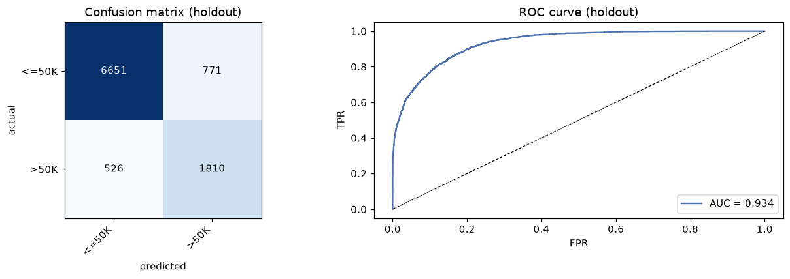
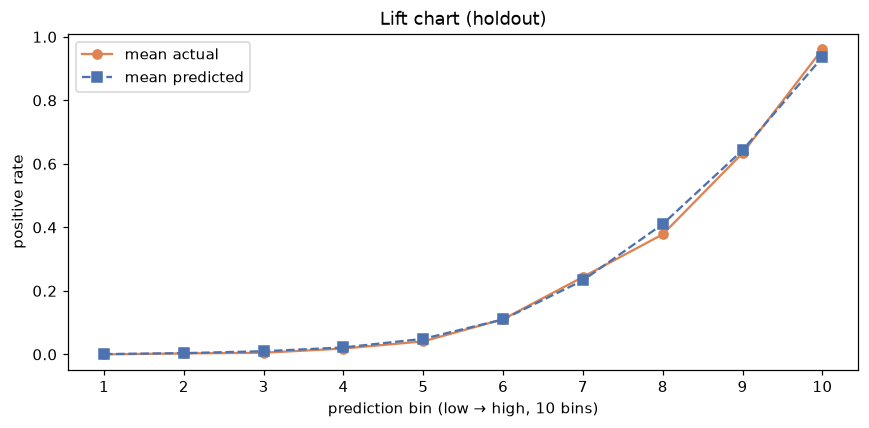

# AutoML Lab · tabular engine — automated modeling on scikit-learn

**Drop in a dataset, name the target, Run All — get a deployable model back.**

Two notebooks (classification and regression) drive a shared, unit-tested
engine that automates the workflow a commercial AutoML platform sells:
data-quality guardrails, target-leakage detection, a multi-family model
leaderboard with tuning and blending, honest holdout evaluation with
confidence intervals, explainability, drift monitoring, and a one-folder
deployable artifact — every automated decision logged and auditable.

The goal is the ~20% of a commercial AutoML platform that covers ~80% of
everyday tabular classification/regression work, at $0, in code you can
read, test, and extend.

## Quickstart

```bash
pip install -r requirements.txt
jupyter notebook notebooks/automl_classification.ipynb   # or _regression
```

Edit the `CONFIG` cell (`data_path`, `target`), then *Run All*. With
`data_path=None` each notebook runs a public demo dataset end-to-end, so you
can see everything work before pointing it at your data. In a hurry:

```python
from automl import AutoML, AutoMLConfig
aml = AutoML(AutoMLConfig.fast(target="income", task="classification"))
aml.run(df)          # ~2 minutes on mid-size data, full artifact included
```

## Results on the demo datasets

Both notebooks are committed **with their executed outputs**, and the model
reports they generated are in [`examples/`](examples/) — you can inspect every
number below without running anything. Baselines were fit on the *identical*
train/holdout partition the engine used (its own split, seed 42), so the
comparison is holdout-exact.

**[Adult census income](https://archive.ics.uci.edu/dataset/2/adult)** — will
income exceed $50K? (48,842 rows; 9,758-row locked holdout; 18.8 min on 4 cores)

| Model | LogLoss ↓ | ROC AUC ↑ |
|---|---|---|
| Base-rate baseline (predicts the training prior) | 0.550 | 0.500 |
| XGBoost, default parameters | 0.272 | 0.931 |
| **This engine — Voting blend of 3 finalists** | **0.266** | **0.934** |

**[Diamonds](https://ggplot2.tidyverse.org/reference/diamonds.html)** — price
from carat, cut, color, clarity, dimensions (53,940 rows; 10,759-row locked
holdout; 29.3 min on 4 cores)

| Model | RMSE ↓ | MAE ↓ | R² ↑ |
|---|---|---|---|
| Mean-predictor baseline | 3,997 | 3,041 | 0.000 |
| XGBoost, default parameters | 554 | **278** | 0.981 |
| **This engine — Stacked blend of 3 finalists** | **538** | 279 | **0.982** |

<p align="center">
  <br>
  
</p>

Honest reading: the engine beats a well-configured default XGBoost by ~2–3% on
the primary metric on both datasets — real but not magic, which is exactly the
margin disciplined AutoML should buy on clean tabular data. For how it stacks
up against AutoGluon under comparable time budgets on these same partitions
(matched on Adult; one disclosed imbalance on Diamonds), see
[the AutoML benchmark](../benchmarks/tabular/): 0.8–4.3% behind the
strongest open-source AutoML on the point estimates, with a much lighter
deployment story. (The benchmark re-fits the engine on the identical
partition; note that `results.json` there predates these reports by several
engine commits and a scikit-learn minor version, so the two are close but are
not the same run — the benchmark README carries the provenance note, and also
explains why those point-estimate gaps are *not* established as significant.)
(Diamonds MAE is
slightly higher because the champion optimizes RMSE, the auto-selected primary
metric.) The demo leaderboards also show the machinery working: blenders win
both projects — the classic AutoML result —
log-target siblings competed on the skewed price target, and XGBoost's
"defaults kept" row shows the tuning stage refusing to ship a search result
that couldn't beat the baseline configuration.

Worth noting what the runners-up are: the best single model on each dataset is
a `defaults · fresh-fold CV` row in the committed reports (Adult, XGBoost
0.2771; Diamonds, LightGBM_logy 578.73), so on these two clean datasets the
tuning stage never beat its own defaults by more than fold noise. That is a
weaker result for the search and a stronger one for the default-config
guarantee, and it is what the reports say.

Winning the leaderboard still isn't the same as earning deployment, so a
**parsimony rule** asks separately whether each blend's margin justifies three
models to retrain and monitor. On Adult it does: the 0.0020 lead over XGBoost
is outside the standard error of the paired per-fold differences, so Voting(3)
is both winner and pick. On Diamonds the rule bites, but only by one step — the
winner Stacked(3) (570.67) and Voting(3) (571.32) are 0.64 RMSE apart and
indistinguishable, so the simpler *blend* ships, while the 8-RMSE gap down to a
single model is resolvable and does not qualify. The leaderboard stays
accuracy-ranked; the pick ships in the decision log, report, and metadata, and
`champion_policy="parsimonious"` exports it as the champion. Accuracy decides
the leaderboard — it doesn't get to decide the deployment alone (see
[the design note](../docs/DESIGN.md#the-leaderboard-is-a-measurement-the-deployment-pick-is-a-judgment),
which records how an earlier, too-wide version of this band was picking single
models on every dataset and why that uniformity was the tell that it was wrong).

## What the engine does

| Stage | What happens |
|---|---|
| **Profile & guardrails** | per-feature profiling; drops (with logged reasons) for missingness, constants, ID-like columns; datetime columns decomposed into model-ready parts; long text columns TF-IDF-vectorized; duplicate rows removed before splitting |
| **Partition & metric** | locked holdout carved off first; random, **time-aware** (out-of-time holdout + expanding-window CV) or **group-aware** (no entity straddles a split) partitioning; distribution-aware metric selection on training rows only |
| **Leakage scan** | two detectors — a depth-6 single-feature tree for every feature, plus \|Spearman\| vs target for numeric features on regression targets — because each catches leaks the other structurally misses; post-modeling guardrail flags suspiciously perfect holdout scores |
| **Leaderboard, stage 1** | linear, random forest, extra trees, HistGB, XGBoost, LightGBM, CatBoost over three preprocessing blueprints (linear / tree / native-categorical), identical CV folds, capped sample on large data |
| **Stage 2 tuning** | Optuna per finalist with the **default config always kept as baseline** (tuning can never ship a worse model); early stopping owns GBM tree counts so trials aren't burned on `n_estimators` |
| **Blend & re-score** | stacking + soft-voting blenders join the finalists; **every candidate re-scored with one CV pass on fresh folds** — the champion is chosen free of winner's-curse and mixed-basis comparisons (fresh reshuffled folds apply to the random and group strategies; time-aware runs necessarily reuse the chronological folds — which removes the mixed-basis effect but not the search's selection bias — and the decision log and leaderboard labels say so); a parsimony rule then flags the simplest candidate within one standard error of the best score (the SE of the paired per-fold differences, not the marginal fold spread) as the **deployment pick** (`champion_policy` decides which one ships) |
| **Finalize & evaluate** | calibration repaired when an out-of-fold check shows it helps and a binary decision threshold tuned out-of-fold, both shipped *inside* the artifact (`predict()` applies them; both are binary-only — multiclass ships argmax with unrepaired probabilities, and the log says so); holdout metrics with bootstrap CIs, lift, ROC, calibration curves |
| **Explain** | permutation importance, partial dependence, SHAP — with the correlated-features caveat stated rather than hidden |
| **Export** | `model.joblib` (one fitted sklearn estimator, preprocessing included), `metadata.json`, generated `predict.py` batch scorer (smoke-tested at export), `drift_check.py` (PSI), `Dockerfile`, pinned `requirements.txt`, self-contained `report.html` |

Target-aware modeling choices the leaderboard makes on its own:

- MAE-primary runs (skewed/outlier-heavy targets) switch GBM objectives to
  absolute error, so models optimize the metric they're ranked on.
- Non-negative integer targets add Poisson-objective variants; zero-inflated
  targets add Tweedie; strictly positive skewed targets add Gamma and
  log1p-target siblings (`TransformedTargetRegressor`) — all scored on the
  original scale, so the leaderboard itself decides raw vs transformed.
- Imbalanced classification adds class-weighted variants that *compete*
  instead of forcing weighting everywhere (weighting distorts the calibrated
  probabilities LogLoss protects).

## The artifact

```
artifacts_<task>/
├── model.joblib        # preprocessing + model in one sklearn estimator
├── metadata.json       # schema, recipe, scores, decisions, drift reference
├── predict.py          # CLI batch scorer: schema checks, recipe, proba, labels
├── drift_check.py      # PSI drift report from metadata alone
├── Dockerfile          # ready-to-build scoring image
├── requirements.txt    # pinned inference deps
└── report.html         # shareable model report: leaderboard, metrics + CIs,
                        # all figures, full decision audit
```

No custom code is needed at inference: the pipeline is pure scikit-learn, and
the stateless preparation recipe (column renames, date decomposition, text
NaN-fill) is recorded in the metadata and applied by the generated `predict.py`.

## Repo layout

```
tabular/
├── automl/            # the engine — 16 importable modules
├── notebooks/         # thin narrated drivers, committed with executed outputs
├── examples/          # the model reports those demo runs generated
├── tests/             # pytest suite: e2e smokes + guardrail regression tests
├── pyproject.toml     # installable package metadata (pip install -e .)
└── requirements.txt   # training environment
```

| Module | Responsibility |
|---|---|
| `core.py` | the orchestrator: a staged, notebook-friendly API |
| `config.py` | run configuration |
| `profiling.py` | data loading, quality guardrails, stateless preparation |
| `partition.py` | train/holdout partitioning and CV strategy |
| `target.py` | task validation, metric selection, objective-family detection |
| `leakage.py` | two-detector leakage scan + correlated-feature pruning |
| `preprocess.py` | preprocessing blueprints matched to model family |
| `models.py` | roster construction, early-stopping-aware fitting |
| `search.py` | stage-2 Optuna search with the default-baseline guarantee |
| `ensemble.py` | stacking and soft-voting blenders |
| `evaluate.py` | calibration repair, operating point, holdout evaluation |
| `explain.py` | permutation importance, partial dependence, SHAP |
| `drift.py` | PSI drift reference + standalone checker source |
| `report.py` | the self-contained HTML model report |
| `artifacts.py` | artifact export: pipeline, metadata, scorer, Dockerfile |
| `utils.py` | errors, decision logging, model-thread control |

Run the tests with `python -m pytest tests -q` (~2 minutes, 41 tests). The
[CI workflows](../.github/workflows/) lint (ruff), type-check (mypy), and run
the suite against both pandas 2 and pandas 3.

**Reproducibility:** runs are seeded end-to-end (`random_state=42`), but GBM
training is multithreaded (`n_jobs=-1`) and therefore not bit-deterministic —
repeat runs agree with the demo metrics to roughly three decimals, not
bit-for-bit.

## Design positions (and the failure modes they prevent)

- **A locked holdout is non-negotiable.** Model selection, tuning, calibration
  and threshold choice all happen on training folds; the holdout is scored
  once. The exported model can optionally be refit on 100% of rows, but the
  metadata pairs the holdout metrics with the pre-refit model and says so.
- **Leaderboards must compare like with like.** Optuna's best-of-N CV score is
  optimistically biased, and sample-based scores aren't comparable to
  full-data scores — so the final ranking comes from one fresh-fold CV pass
  over every candidate.
- **Automation must be auditable.** Every automated decision is printed and
  shipped in the artifact (`metadata.json` → `decision_log`, and the report).
  Warnings aren't blanket-silenced; convergence problems are logged.
- **Guardrails should fail loudly and specifically.** Un-modelable inputs
  (zero variance target, every feature dropped, duplicate column names, a
  class too rare to cross-validate) stop the run with an error that says what
  to do — not a cryptic traceback five cells later.

## Limitations

- **Tabular classification and regression only** — no time-series forecasting,
  no image/geospatial, no automatic feature discovery across related tables.
- **Leakage detection is univariate.** Combinatorial leaks (a ratio that
  reconstructs the target only in combination with another column) are caught
  only by the near-perfect-score guardrail after modeling.
- The leakage scan and correlation pruning run once on the training partition,
  outside the CV loop. This is standard practice (and what the locked holdout
  is for), but a fully nested pipeline would be stricter.
- **Correlation pruning picks between near-duplicate features on a univariate
  criterion, and it can pick wrong — expensively.** On the Diamonds demo it
  keeps `y` (width in mm) over `carat` (weight) because `y` has the stronger
  single-feature target association; a
  [measured ablation](../benchmarks/tabular/README.md#ablation-the-pruner-picks-the-wrong-twin-on-diamonds)
  puts the cost at 18.3 RMSE — 82% of the engine's gap to AutoGluon on that
  dataset. Nothing downstream catches it, because the pruned model is
  internally consistent and its holdout score looks fine. `force_keep_columns`
  is the escape hatch and the drop is always in the decision log, so the
  decision is visible; it is not automatic.
- Inference pins are derived by walking the exported pipeline, so an artifact
  carries only the model libraries its champion actually uses. The pins are
  only as precise as that walk: a champion holding an estimator that hides its
  sub-models outside `get_params` and outside fitted `*_` attributes would be
  under-pinned. Nothing in the current roster does, and the export smoke test
  scores the reloaded artifact, but it is a walk rather than a proof.
- Text handling is TF-IDF/hashing — competent, not state-of-the-art; no
  embeddings or fine-tuned language models.
- Blenders use the tuned finalists as-is; larger systems explore a far wider
  blueprint/blender space with far more compute.
- SHAP explanations are skipped for stacking/voting/calibrated champions
  (explaining those well needs KernelSHAP-class compute) and for one known
  shap/CatBoost multiclass incompatibility.
- No GPU support, no distributed training, no model monitoring service —
  `drift_check.py` gives you the signal; acting on it is your pipeline's job.

The cross-cutting omissions — and the triage criterion behind all of them —
are in [docs/SCOPE.md](../docs/SCOPE.md).

## When a commercial platform still makes sense

Governance workflows, compliance documentation at audit depth,
deployment/monitoring infrastructure at org scale, and vendor support.
This project's claim is narrower: for everyday tabular modeling, a disciplined
open-source pipeline gets you to a comparable model with full transparency.
